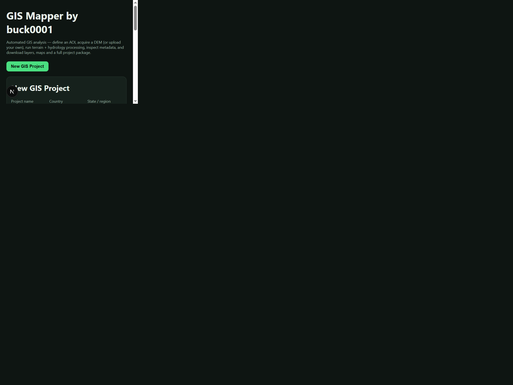
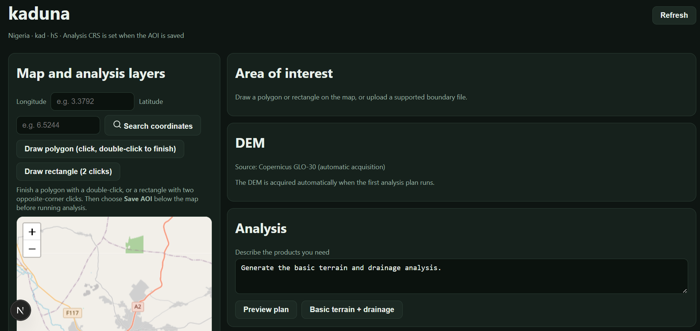
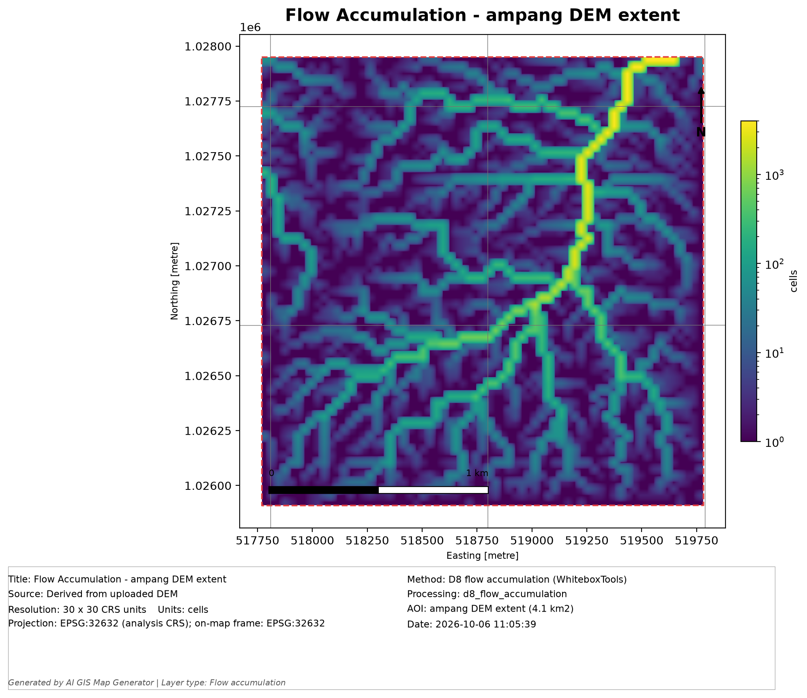

GIS Mapper

GIS Mapper by buck0001 is a local GIS application for preparing areas of interest (AOIs), acquiring or uploading digital elevation models (DEMs), performing terrain and hydrology analysis, visualizing GIS layers, and exporting maps and project data.

This guide is written for a anyone setting up the app on Windows. The application has a Next.js frontend and a Python/FastAPI GIS backend. The backend stores projects in a local SQLite database and writes project files under `data\storage`.

## Screenshots








## Features

- Create and reopen GIS projects.
- Define an AOI by drawing a polygon or rectangle, uploading a boundary file, or using coordinate search to move the map.
- Automatically acquire Copernicus DEM GLO-30 data for an AOI, or upload a GeoTIFF DEM.
- Run terrain and hydrology processing using WhiteboxTools.
- Display result layers and download raster/vector data.
- Export individual maps as PNG or PDF, with a QA report alongside each map.
- Download a project package containing available data, processing intermediates, maps, and reports.

## Requirements

Install these before starting:

- Windows 10/11, 64-bit.
- Python 3.11 recommended.
- Node.js 20 LTS or newer, including npm.
- Internet access for installing dependencies, downloading WhiteboxTools on first use, acquiring Copernicus DEM tiles, and loading the OpenStreetMap basemap.

The app does not require API keys for its configured DEM source. DEM acquisition and map tiles do require an internet connection.

## Install

Open PowerShell in the project folder (the folder containing `README.md`).

### 1. Set up the Python backend

```powershell
py -3.11 -m venv .venv

Activate it:

.\.venv\Scripts\Activate.ps1

Upgrade pip and install the backend dependencies:

python -m pip install --upgrade pip
python -m pip install -r requirements.txt

If PowerShell prevents the virtual environment from activating, run:

Set-ExecutionPolicy -Scope Process -ExecutionPolicy Bypass

Then activate the environment again.

Alternatively, you can run the Python commands without activating the environment by using:

.\.venv\Scripts\python.exe
2. Set up the frontend

Open a second PowerShell window in the project directory:

Set-Location .\frontend
npm ci

npm ci installs the exact dependency versions specified in frontend\package-lock.json.

Running the Application

GIS Mapper uses two local services:

FastAPI backend: 127.0.0.1:8000
Next.js frontend: localhost:3000

Run them in separate PowerShell windows.

Start the backend

From the project directory:

python -m uvicorn api.main:app --reload --host 127.0.0.1 --port 8000

Check the backend health endpoint:

http://127.0.0.1:8000/api/health

A healthy backend returns a JSON response containing:

{
  "status": "ok"
}
Start the frontend

In the second PowerShell window:

Set-Location .\frontend
npm run dev

Then open:

http://localhost:3000

Keep both PowerShell windows running while using the application.

To stop either service, press Ctrl+C in its PowerShell window.

Using GIS Mapper
Create a Project
Open http://localhost:3000.
Enter a project name.
Optionally enter the country, region, or district.
Select a DEM source:
Get one automatically to acquire Copernicus DEM GLO-30 data.
Upload your DEM to use an existing GeoTIFF.
Select Create Project.
Define an Area of Interest

For automatic DEM acquisition, an AOI must be saved before analysis.

The AOI can be defined by:

Searching for coordinates.
Drawing a polygon.
Drawing a rectangle.
Uploading a boundary file.

Supported boundary formats include:

GeoJSON
Zipped Shapefile
KML/KMZ
GeoPackage

To search for a location, enter longitude and latitude and select Search Coordinates.

When drawing a polygon, click each vertex and double-click to finish.

The saved AOI is used for DEM clipping and subsequent analysis. Creating or uploading another boundary replaces the existing AOI.

Working with DEMs
Automatic DEM Acquisition

Projects using automatic acquisition download and clip Copernicus DEM GLO-30 data based on the saved AOI.

The DEM is acquired when the first analysis requiring elevation data is run.

Uploading a DEM

Projects using an uploaded DEM accept GeoTIFF files (.tif or .tiff).

Select a GeoTIFF.
Select Inspect DEM.
Review the validation information.
Check the CRS, coverage, resolution, and NoData information.
Confirm the DEM before starting analysis.

If NoData values need to be handled, enable Fill NoData during processing when appropriate for the dataset and analysis.

If the raster has no CRS, use Assign CRS only when the actual CRS is known.

Assigning a CRS does not reproject the raster. It only defines how the existing coordinates should be interpreted.

A confirmed DEM can be analyzed without an AOI. In that case, the full DEM footprint is used.

An AOI can still be drawn or uploaded to restrict the analysis to a smaller area.

Running GIS Analysis

Open the Analysis section and either:

Describe the terrain or hydrology products required and select Preview Plan, or
Use Basic Terrain + Drainage.

Review the proposed processing steps before starting the analysis.

For analyses involving stream extraction or dependent hydrology products, provide a positive Stream Threshold (flow-accumulation cells) unless the selected processing plan already defines one.

GIS Mapper does not apply a universal stream threshold. The appropriate threshold should be selected according to the study area, dataset, and analysis requirements.

Select Run Analysis to start processing.

Processing status and progress are displayed on the project page.

When processing is complete, the generated layers appear under Result Layers.

Use the layer checkboxes to show or hide results on the map.

Contour Generation

To generate contours:

Enter a Contour Interval (m) under Result Layers.
Select Generate Contour Layer.

The generated vector layer will appear with the other results and can be displayed or downloaded.

Hydrology Processing

Hydrology workflows use depression breaching before D8 flow analysis by default.

Depression filling is available as a separate explicit operation and is not silently substituted if breaching fails.

Downloading Data and Maps
Download GIS Layers

Select Download beside a result layer to download its underlying raster or vector file.

Export Maps

Select an export format:

PNG
PDF

Then select Export Map beside the desired layer.

Each map export also generates a .qa.json quality-assurance report.

The export remains available in the project's exports list after it has been generated.

Download a Project Package

Use Download Project Package to create a ZIP containing available:

Input data
AOI files
Processing intermediates
Result layers
Maps
QA reports
Other project exports

A saved AOI is required to create a project package.

An export marked NOT CLIENT-READY can still be downloaded. The accompanying QA report identifies unresolved requirements.

Administrative boundaries, locator maps, and other cartographic elements are not automatically fabricated or marked as complete when they have not been provided or verified. Final map outputs should therefore undergo manual cartographic review before professional delivery.

Project Data Storage

GIS Mapper stores project data locally.

The following directories are excluded from GitHub through .gitignore.

data\
├── gis.db
├── cache\
│   └── dem\
└── storage\
    └── <project-id>\
        ├── source\
        ├── processed\
        ├── outputs\
        ├── previews\
        ├── maps\
        └── exports\
Storage Locations
Location	Purpose
data\gis.db	Local SQLite database
data\cache\dem\	Downloaded Copernicus DEM tiles
data\storage\<project-id>\source\	Uploaded/acquired inputs and AOIs
data\storage\<project-id>\processed\	Intermediate processing rasters and vectors
data\storage\<project-id>\outputs\	Final GIS result layers
data\storage\<project-id>\previews\	Browser map previews
data\storage\<project-id>\maps\	Exported PNG/PDF maps and QA reports
data\storage\<project-id>\exports\	Project ZIP packages and other exports
frontend\node_modules\	Frontend dependencies
.venv\	Python virtual environment

Generated maps, DEMs, AOIs, result layers, and project packages are not included when the source code is pushed to GitHub.

Back up data\gis.db and the relevant project directories if projects need to be retained or transferred to another computer.

Project data is stored locally and is not automatically synchronized between computers.

Troubleshooting
Backend is unreachable

Make sure the backend is running and check:

http://127.0.0.1:8000/api/health

DEM acquisition fails

Check your internet connection and try again.

Automatic acquisition uses public Copernicus DEM GLO-30 data.

WhiteboxTools is unavailable

Make sure the Python whitebox dependency installed successfully.

Internet access is required during the first run so the required WhiteboxTools executable can be obtained.

Analysis fails or produces no layers

Open the project's Failed Jobs section and review the reported error.

Also verify:

The AOI is valid.
The DEM passed validation.
Required stream thresholds have been provided.
The selected processing operation is supported by the input data.
Basemap is blank

The OpenStreetMap basemap requires an internet connection.

Local result layers and GIS processing can still be available even when the basemap cannot load.

DEM has no CRS

Verify the CRS from the dataset's documentation before assigning one.

Do not guess the CRS.

Port 3000 or 8000 is already in use

Stop the process currently using the port or configure the application to use another available port.

Development Checks
Backend

From the project directory:

.\.venv\Scripts\Activate.ps1
python -m unittest tests.test_map_rendering tests.test_hydrology_spec tests.test_terrain tests.test_uploaded_dem_no_aoi tests.test_job_layer_storage
python tests\smoke_e2e.py
Frontend

From the frontend directory:

npm audit
npm run build
External Data and Attribution
Copernicus DEM GLO-30

GIS Mapper uses Copernicus DEM GLO-30 data provided through the Copernicus Programme / ESA via AWS Open Data.

When redistributing Copernicus DEM-derived data, check the current licensing, attribution, and redistribution requirements.

OpenStreetMap

The interactive basemap uses OpenStreetMap data and displays OpenStreetMap attribution.

Follow the applicable OpenStreetMap and tile usage policies when deploying or distributing the application.

Map Branding

Generated map exports are branded:

GIS Mapper by buck0001

Sharing the Application

When sharing GIS Mapper with a colleague, provide the application source code and this README.

Do not share these directories unless specifically required:

frontend\node_modules\
.venv\

They can be recreated using the installation instructions above.

If saved projects need to be transferred, share:

data\gis.db
data\storage\

Only transfer project inputs and outputs when you have the necessary permission to share them.

Security and Deployment

GIS Mapper is designed primarily for local, trusted use.

The development server is intended for trusted local use, not direct exposure to the public internet. This setup does not provide user authentication or access control.
